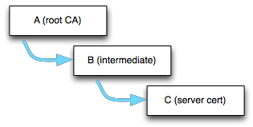

# キーと証明書


X.509証明書の紹介と、SSLおよびTLSでの使用方法については、付録Aを参照してください。


## サポートされている形式とサイズ


wolfSSL(以前のCyassl)は、** pem **、および** der **証明書とキーのフォーマット、およびPKCS＃8プライベートキー(PKCS＃5またはPKCS＃12暗号化)をサポートしています。


** PEM **、または「プライバシー強化されたメール」は、証明書が証明書当局によって発行される最も一般的な形式です。PEMファイルは、複数のサーバー証明書、中間証明書、およびプライベートキーを含むことができるBase64エンコードASCIIファイルであり、通常`.pem`、`.crt`、`.cer`、または`.key`ファイル拡張子を備えています。PEMファイル内の証明書は、「`-----BEGIN CERTIFICATE-----`」および「`-----END CERTIFICATE-----`」ステートメントに包まれています。


** der **、または「区別されたエンコードルール」は、証明書のバイナリ形式です。derファイル拡張子には`.der`および`.cer`を含めることができ、テキストエディターでは表示できません。


X.509証明書は、ASN.1形式を使用してエンコードされます。der形式はasn.1エンコーディングです。PEM形式は、Base64エンコードされており、人間の読み取り可能なヘッダーとフッターでラップされています。TLSはDER形式で証明書を送信します。


## 証明書の読み込み


証明書は通常、ファイルシステムを使用してロードされます(ただし、メモリバッファーからの読み込みもサポートされています -  [ファイルシステムがなく、証明書の使用](#no-file-system-and-using-certificates)を参照)。


### CA証明書をロードする**


CA証明書ファイルは、[`wolfSSL_CTX_load_verify_locations()`](group__CertsKeys.md#function-wolfssl_ctx_load_verify_locations)関数を使用してロードできます。


```c
int wolfSSL_CTX_load_verify_locations(WOLFSSL_CTX *ctx,
                                      const char *CAfile,
                                      const char *CApath);
```


CA Loadingは、PEM形式で`CAfile`をできるだけ多くのCERTで渡して、上記の機能を使用してファイルごとの複数のCA証明書を解析することもできます。これにより、初期化が簡単になり、クライアントが起動時に複数のルートCASをロードする必要がある場合に役立ちます。これにより、wolfSSLはCAS用の単一のファイルを使用できるようにするツールに移植するのを簡単にします。


**注**：ルーツのチェーンと中間証明書をロードする必要がある場合は、信頼の順にロードする必要があります。最初にルートCAをロードした後、中間体1に続いて中間体2などが続きます。CERTがロードされるごとに[`wolfSSL_CTX_load_verify_locations()`](group__CertsKeys.md#function-wolfssl_ctx_load_verify_locations)を呼び出すか、CERTを順番に含むファイルを1回(ファイルの上部にルートと信頼のチェーンによって注文した証明書)を使用できます。


### クライアントまたはサーバーの証明書を読み込みます


単一のクライアントまたはサーバー証明書の読み込みは、[`wolfSSL_CTX_use_certificate_file()`](group__CertsKeys.md#function-wolfssl_ctx_use_certificate_file)関数で実行できます。この関数が証明書チェーンで使用される場合、実際の、または「下」証明書のみが送信されます。


```c
int wolfSSL_CTX_use_certificate_file(WOLFSSL_CTX *ctx,
                                     const char *CAfile,
                                     int type);
```


`CAfile`はCA証明書ファイルであり、`type`は`SSL_FILETYPE_PEM`などの証明書の形式です。


サーバーとクライアントは、[`wolfSSL_CTX_use_certificate_chain_file()`](group__CertsKeys.md#function-wolfssl_ctx_use_certificate_chain_file)関数を使用して証明書チェーンを送信できます。証明書チェーンファイルはPEM形式である必要があり、被験者の証明書(実際のクライアントまたはサーバー証明書)から始まり、その後、中間証明書が続き、(オプションでは)ルート「トップ」caで終了する必要があります。サンプルサーバー(`/examples/server/server.c`)は、この機能を使用します。


**注意**：これは証明書チェーンをロードするときに必要な順序の正確な逆です。このシナリオのファイルの内容は、ファイルの上部のエンティティ証明書とそれに続くファイルの下部にあるルートCAを使用して、その後のCERT UP CHAREを実行します。


```c
int wolfSSL_CTX_use_certificate_chain_file(WOLFSSL_CTX *ctx,
                                 const char *file);
```


### 秘密鍵を読み込む


サーバープライベートキーは、[`wolfSSL_CTX_use_PrivateKey_file()`](group__CertsKeys.md#function-wolfssl_ctx_use_PrivateKey_file)関数を使用してロードできます。


```c
int wolfSSL_CTX_use_PrivateKey_file(WOLFSSL_CTX *ctx,
                      const char *keyFile, int type);
```


`keyFile`は秘密のキーファイルであり、`type`は秘密鍵の形式です(例：`SSL_FILETYPE_PEM`)。


### 信頼できるピア証明書を読み込みます


使用する信頼できるピア証明書を読み込むことは、[`wolfSSL_CTX_trust_peer_cert()`](group__Setup.md#function-wolfssl_ctx_trust_peer_cert)で行うことができます。


```c
int wolfSSL_CTX_trust_peer_cert(WOLFSSL_CTX *ctx,
                 const char *trustCert, int type);
```


`trustCert`はロードする証明書ファイルであり、`type`は秘密鍵の形式(つまり`SSL_FILETYPE_PEM`)です。


## 証明書チェーン検証


wolfSSLは、証明書チェーンを検証するために信頼できる証明書としてロードされるチェーン内の上位または「ルート」証明書だけを必要とします。これは、証明書チェーン(A  -  \> B  -  \> C)を持っている場合、ここでCがBによって署名され、Bが署名されている場合、wolfSSLは証明書Aを信頼できる証明書としてロードする必要があることを意味します。チェーン全体を確認します(a  -  \> b  -  \> c)。


たとえば、サーバー証明書チェーンが次のように見える場合




wolfSSLクライアントには、少なくともルート証明書(a)が信頼できるルート([`wolfSSL_CTX_load_verify_locations()`](group__CertsKeys.md#function-wolfssl_ctx_load_verify_locations))としてロードされている必要があります。クライアントがサーバーCERTチェーンを受信すると、Aの署名を使用してBを検証し、Bが以前に信頼できるルートとしてwolfSSLにロードされていなかった場合、BはwolfSSLの内部CERTチェーンに保存されます(wolfSSLは必要なものを保存します証明書の確認：一般名ハッシュ、公開キー、キータイプなど)。Bが有効な場合、Cを確認するために使用されます。


このモデルに従って、ルート証明書「A」がwolfSSLサーバーに信頼できるルートとしてロードされている限り、サーバーが送信する場合、サーバー証明書チェーンを確認することができます(A- \> B  -  \> C)、または(b- \> c)。サーバーが中間証明書ではなく(c)を送信するだけの場合、wolfSSLクライアントが既にBを信頼できるルートとしてロードしていない限り、チェーンを検証することはできません。


## ドメイン名サーバー証明書のチェック


wolfSSLには、サーバー証明書のドメインを自動的にチェックするクライアントに拡張機能があります。OpenSSLモードでは、これを実行するにはほぼ12の関数呼び出しが必要です。wolfSSLは、証明書の日付が範囲にあることをチェックし、署名を検証し、[`wolfSSL_connect()`](group__IO.md#function-wolfssl_connect)を呼び出す前に[`wolfSSL_check_domain_name(WOLFSSL* ssl, const char* dn)`](group__Setup.md#function-wolfssl_check_domain_name)を呼び出す場合、ドメインをさらに検証します。。名前が[`wolfSSL_connect()`](group__IO.md#function-wolfssl_connect)が正常に進行する場合、名前の不一致がある場合、[`wolfSSL_connect()`](group__IO.md#function-wolfssl_connect)は致命的なエラーを返し、[`wolfSSL_get_error()`](group__Debug.md#function-wolfssl_get_error)は`DOMAIN_NAME_MISMATCH`を返します。


証明書のドメイン名を確認することは、サーバーが実際にあると主張しているのかを確認する重要な手順です。この拡張は、チェックを実行する負担を軽減することを目的としています。


## ファイルシステムがなく、証明書の使用


通常、ファイルシステムは、プライベートキー、証明書、およびCAのロードに使用されます。wolfSSLは完全なファイルシステムのない環境で使用されることがあるため、代わりにメモリバッファーを使用するための拡張機能が提供されます。拡張機能を使用するには、定数`NO_FILESYSTEM`を定義し、次の機能が利用可能になります。


* [`int wolfSSL_CTX_load_verify_buffer(WOLFSSL_CTX* ctx, const unsigned char* in,long sz, int format);`](group__CertsKeys.md#function-wolfssl_ctx_load_verify_buffer)


* [`int wolfSSL_CTX_use_certificate_buffer(WOLFSSL_CTX* ctx, const unsigned char* in, long sz, int format);`](group__CertsKeys.md#function-wolfssl_ctx_use_certificate_buffer)


* [`int wolfSSL_CTX_use_PrivateKey_buffer(WOLFSSL_CTX* ctx, const unsigned char* in, long sz, int format);`](group__CertsKeys.md#function-wolfssl_ctx_use_PrivateKey_buffer)


* [`int wolfSSL_CTX_use_certificate_chain_buffer(WOLFSSL_CTX* ctx, const unsigned char* in,long sz);`](group__CertsKeys.md#function-wolfssl_ctx_use_certificate_chain_buffer)


* [`int wolfSSL_CTX_trust_peer_buffer(WOLFSSL_CTX* ctx, const unsigned char* in, Long sz, int format);`](group__Setup.md#function-wolfssl_ctx_trust_peer_buffer)


これらの関数を`*_buffer`ではなく`*_file`という名前のカウンターパートとまったく同じように使用します。そして、ファイル名を指定する代わりにメモリバッファを提供します。使用上の詳細についてはAPIの資料を参照してください。


### テスト証明書とキーバッファー


wolfSSLは、過去にテスト証明書とキーファイルがバンドルされています。また、ファイルシステムが利用できない環境で使用するためのテスト証明書とキーバッファがバンドルされています。これらのバッファーは、`USE_CERT_BUFFERS_1024`、`USE_CERT_BUFFERS_2048`、または`USE_CERT_BUFFERS_256`の1つ以上を定義する場合、`certs_test.h`で利用できます。


## シリアル番号検索


X.509証明書のシリアル番号は、[`wolfSSL_X509_get_serial_number()`](group__openSSL.md#function-wolfssl_x509_get_serial_number)を使用してwolfSSLから抽出できます。


```c
int wolfSSL_X509_get_serial_number(WOLFSSL_X509* x509,
            unsigned char* buffer, int* inOutSz)
```


`buffer`は、入力で最大`*inOutSz`バイトで書き込まれます。コールの後、成功した場合(0の戻り)、`*inOutSz`は`buffer`に書き込まれた実際のバイト数を保持します。完全な例は`wolfssl/test.h`が含まれています。


## RSAキー生成


wolfSSLは、最大4096ビットのさまざまな長さのRSAキー生成をサポートしています。キー生成はデフォルトでオフになっていますが、`--enable-keygen`の`./configure`プロセス中に、またはWindowsまたは非標準の環境で`WOLFSSL_KEY_GEN`を定義することにより、オンにすることができます。キーを作成するのは簡単で、`rsa.h`から1つの関数のみが必要です。


```c
int MakeRsaKey(RsaKey* key, int size, long e, RNG* rng);
```


`size`はBITSの長さで、`e`が公開指数です。


```c
RsaKey genKey;
RNG    rng;
int    ret;

InitRng(&rng);
InitRsaKey(&genKey, 0);

ret=MakeRsaKey(&genKey, 1024, 65537, &rng);
if (ret != 0)
    /* ret contains error */;
```


RSAKEY `genKey`は、他のRSAKEYのように使用できるようになりました。キーをエクスポートする必要がある場合は、wolfsslはasn.hでDERとPEMフォーマットの両方を提供します。常にキーを最初にDERフォーマットに変換してから、PEMが必要な場合は汎用`DerToPem()`関数を使用する必要があります。


```c
byte der[4096];
int  derSz=RsaKeyToDer(&genKey, der, sizeof(der));
if (derSz < 0)
    /* derSz contains error */;
```


バッファ`der`は、キーのDERフォーマットを保持する。DERバッファをPEMに変換するには、変換関数を使用します。


```c
byte pem[4096];
int  pemSz=DerToPem(der, derSz, pem, sizeof(pem),
                      PRIVATEKEY_TYPE);
if (pemSz < 0)
    /* pemSz contains error */;
```


_dertopem()_の最後の引数は、通常`PRIVATEKEY_TYPE`または`CERT_TYPE`のタイプパラメーターを取得します。これで、バッファ`pem`がキーのPEM形式を保持します。サポートされているタイプは次のとおりです。


* `CA_TYPE`


* `TRUSTED_PEER_TYPE`


* `CERT_TYPE`


* `CRL_TYPE`


* `DH_PARAM_TYPE`


* `DSA_PARAM_TYPE`


* `CERTREQ_TYPE`


* `DSA_TYPE`


* `DSA_PRIVATEKEY_TYPE`


* `ECC_TYPE`


* `ECC_PRIVATEKEY_TYPE`


* `RSA_TYPE`


* `PRIVATEKEY_TYPE`


* `ED25519_TYPE`


* `EDDSA_PRIVATEKEY_TYPE`


* `PUBLICKEY_TYPE`


* `ECC_PUBLICKEY_TYPE`


* `PKCS8_PRIVATEKEY_TYPE`


* `PKCS8_ENC_PRIVATEKEY_TYPE`


### RSAキー生成ノート


RSA秘密鍵には公開鍵も含まれています。秘密鍵は、test.cで使用されるwolfSSLによってプライベートキーと公開鍵の両方として使用できます。秘密鍵と公開鍵(証明書の形式)は、SSLに通常必要なものすべてです。


必要に応じて、rsapublickeydecode()関数を使用して、別の公開キーを手動でwolfSSLにロードできます。さらに、[`wc_RsaKeyToPublicDer()`](group__RSA.md#function-wc_rsakeytopublicder)関数を使用して、パブリックRSAキーをエクスポートできます。


## 証明書生成


wolfSSLはX.509 V3証明書生成をサポートしています。証明書の生成はデフォルトでオフになっていますが、`--enable-certgen`の`./configure`プロセス中に、またはWindowsまたは非標準の環境で`WOLFSSL_CERT_GEN`を定義することにより、オンにすることができます。


証明書を生成する前に、ユーザーは証明書の主題に関する情報を提供する必要があります。この情報は、`Cert`という名前の`wolfssl/wolfcrypt/asn_public.h`の構造に含まれています。


```c
/* for user to fill for certificate generation */
typedef struct Cert {
    int      version;                   /* x509 version  */
    byte     serial[CTC_SERIAL_SIZE];   /* serial number */
    int      sigType;                   /*signature algo type */
    CertName issuer;                    /* issuer info */
    int      daysValid;                 /* validity days */
    int      selfSigned;                /* self signed flag */
    CertName subject;                   /* subject info */
    int      isCA;                      /*is this going to be a CA*/
    ...
} Cert;
```


CertNameは次のようになります。


```c
typedef struct CertName {
char country[CTC_NAME_SIZE];
    char countryEnc;
    char state[CTC_NAME_SIZE];
    char stateEnc;
    char locality[CTC_NAME_SIZE];
    char localityEnc;
    char sur[CTC_NAME_SIZE];
    char surEnc;
    char org[CTC_NAME_SIZE];
    char orgEnc;
    char unit[CTC_NAME_SIZE];
    char unitEnc;
    char commonName[CTC_NAME_SIZE];
    char commonNameEnc;
    char email[CTC_NAME_SIZE];  /* !!!! email has to be last!!!! */
} CertName;
```


件名情報に記入する前に、初期化機能を次のように呼び出す必要があります。


```c
Cert myCert;
InitCert(&myCert);
```


`InitCert()`バージョンを** 3 **(0x02)に設定し、** 0 **(ランダムに生成された)にシリアル番号を設定するなど、いくつかの変数のデフォルトを設定し、sigtypeから`CTC_SHAwRSA`、daysvalid to ** 500 **、** 1 **(true)に自己署名。サポートされている署名タイプは次のとおりです。


* `CTC_SHAwDSA`


* `CTC_MD2wRSA`


* `CTC_MD5wRSA`


* `CTC_SHAwRSA`


* `CTC_SHAwECDSA`


* `CTC_SHA256wRSA`


* `CTC_SHA256wECDSA`


* `CTC_SHA384wRSA`


* `CTC_SHA384wECDSA`


* `CTC_SHA512wRSA`


* `CTC_SHA512wECDSA`


これで、ユーザーは`wolfcrypt/test/test.c`からこの例のような主題情報を初期化できます。


```c
strncpy(myCert.subject.country, "US", CTC_NAME_SIZE);
strncpy(myCert.subject.state, "OR", CTC_NAME_SIZE);
strncpy(myCert.subject.locality, "Portland", CTC_NAME_SIZE);
strncpy(myCert.subject.org, "yaSSL", CTC_NAME_SIZE);
strncpy(myCert.subject.unit, "Development", CTC_NAME_SIZE);
strncpy(myCert.subject.commonName, "www.wolfssl.com", CTC_NAME_SIZE);
strncpy(myCert.subject.email, "info@wolfssl.com", CTC_NAME_SIZE);
```


次に、上記のキー生成例からの変数GenKeyとRNGを使用して自己署名証明書を生成できます(もちろん、有効なRSAKEYまたはRNGを使用できます)：


```c
byte derCert[4096];

int certSz=MakeSelfCert(&myCert, derCert, sizeof(derCert), &key, &rng);
if (certSz < 0)
  /* certSz contains the error */;
```


バッファ`derCert`には、証明書のDERフォーマットが含まれています。証明書のPEMフォーマットが必要な場合は、Generic `DerToPem()`関数を使用して、このように`CERT_TYPE`になるタイプを指定できます。


```c
byte* pem;

int pemSz=DerToPem(derCert, certSz, pem, sizeof(pemCert), CERT_TYPE);
if (pemCertSz < 0)
  /* pemCertSz contains error */;
```


サポートされているタイプは次のとおりです。


* `CA_TYPE`


* `TRUSTED_PEER_TYPE`


* `CERT_TYPE`


* `CRL_TYPE`


* `DH_PARAM_TYPE`


* `DSA_PARAM_TYPE`


* `CERTREQ_TYPE`


* `DSA_TYPE`


* `DSA_PRIVATEKEY_TYPE`


* `ECC_TYPE`


* `ECC_PRIVATEKEY_TYPE`


* `RSA_TYPE`


* `PRIVATEKEY_TYPE`


* `ED25519_TYPE`


* `EDDSA_PRIVATEKEY_TYPE`


* `PUBLICKEY_TYPE`


* `ECC_PUBLICKEY_TYPE`


* `PKCS8_PRIVATEKEY_TYPE`


* `PKCS8_ENC_PRIVATEKEY_TYPE`


これで、バッファ`pemCert<`が証明書のPEM形式を保持します。


CA署名証明書を作成する場合は、いくつかの手順が必要です。以前のように件名情報を記入した後、CA証明書から発行者情報を設定する必要があります。これは、このように`SetIssuer()`で行うことができます。


```c
ret=SetIssuer(&myCert, "ca-cert.pem");
if (ret < 0)
    /* ret contains error */;
```


その後、証明書を作成してから署名する2ステップのプロセスを実行する必要があります(`MakeSelfCert()`は両方とも1段階で行います)。発行者(`caKey`)と件名(`key`)の両方から秘密鍵が必要です。完全な使用法については`test.c`の例をご覧ください。


```c
byte derCert[4096];

int certSz=MakeCert(&myCert, derCert, sizeof(derCert), &key, NULL, &rng);
if (certSz < 0);
   /*certSz contains the error*/;

certSz=SignCert(myCert.bodySz, myCert.sigType, derCert,
            sizeof(derCert), &caKey, NULL, &rng);
if (certSz < 0);
   /*certSz contains the error*/;
```


バッファ`derCert`には、CA署名証明書のder形式が含まれるようになりました。証明書のPEM形式が必要な場合は、上記の自己署名の例を参照してください。`MakeCert()`および`SignCert()`は、使用するRSAまたはECCキーの関数パラメーターを提供していることに注意してください。上記の例では、RSAキーを使用し、ECCキーパラメーターのnullを渡します。


## 証明書署名要求(CSR)生成


wolfSSLは、X.509 v3証明書署名要求(CSR)生成をサポートしています。CSR生成はデフォルトでオフになっていますが、`--enable-certreq --enable-certgen`で`./configure`プロセス中、またはWindowsまたは非標準の環境で`WOLFSSL_CERT_GEN` **と** `WOLFSSL_CERT_REQ`を定義することによってオンにすることができます。


CSRを生成する前に、ユーザーは証明書の主題に関する情報を提供する必要があります。この情報は、`Cert`という名前の`wolfssl/wolfcrypt/asn_public.h`の構造に含まれています。


CERTおよびCERTNAME構造の詳細については、上記の[証明書生成](#certificat-generation)を参照してください。


件名情報に記入する前に、初期化機能を次のように呼び出す必要があります。


```c
Cert request;
InitCert(&request);
```


`InitCert()`バージョンを** 3 **(0x02)に設定し、** 0 **(ランダムに生成された)にシリアル番号を設定するなど、いくつかの変数のデフォルトを設定し、sigtypeから`CTC_SHAwRSA`、daysvalid to ** 500 **、** 1 **(true)に自己署名。サポートされている署名タイプは次のとおりです。


* `CTC_SHAwDSA`


* `CTC_MD2wRSA`


* `CTC_MD5wRSA`


* `CTC_SHAwRSA`


* `CTC_SHAwECDSA`


* `CTC_SHA256wRSA`


* `CTC_SHA256wECDSA`


* `CTC_SHA384wRSA`


* `CTC_SHA384wECDSA`


* `CTC_SHA512wRSA`


* `CTC_SHA512wECDSA`


これで、ユーザーは<https://github.com/wolfssl/wolfssl-examples/blob/master/certgen/csr_example.c>からこの例のような主題情報を初期化できます。


```c
strncpy(req.subject.country, "US", CTC_NAME_SIZE);
strncpy(req.subject.state, "OR", CTC_NAME_SIZE);
strncpy(req.subject.locality, "Portland", CTC_NAME_SIZE);
strncpy(req.subject.org, "wolfSSL", CTC_NAME_SIZE);
strncpy(req.subject.unit, "Development", CTC_NAME_SIZE);
strncpy(req.subject.commonName, "www.wolfssl.com", CTC_NAME_SIZE);
strncpy(req.subject.email, "info@wolfssl.com", CTC_NAME_SIZE);
```


次に、上記のキー生成例(もちろん有効なECC/RSAキーまたはRNGを使用できます)の変数キーを使用して、有効な署名されたCSRを生成できます。


```c
byte der[4096]; /* Store request in der format once made */

ret=wc_MakeCertReq(&request, der, sizeof(der), NULL, &key);
/* check ret value for error handling, <= 0 indicates a failure */
```


次に、リクエストに署名して有効にします。上記のキー生成例からRNG変数を使用します。(もちろん、有効なECC/RSAキーまたはRNGを使用できます)


```c
derSz=ret;

req.sigType=CTC_SHA256wECDSA;
ret=wc_SignCert(request.bodySz, request.sigType, der, sizeof(der), NULL, &key, &rng);
/* check ret value for error handling, <= 0 indicates a failure */
```


最後に、CSRをPEM形式に変換して、証明書の発行に使用するCA権限に送信します。


```c
ret=wc_DerToPem(der, derSz, pem, sizeof(pem), CERTREQ_TYPE);
/* check ret value for error handling, <= 0 indicates a failure */
printf("%s", pem); /* or write to a file */
```


### 制限


CSRで除外された証明書に必須のフィールドがあります。CSRには、証明書に載っているときに必須の「オプション」と見なされる他のフィールドがあります。このため、すべての証明書フィールドを厳密にチェックし、すべてのフィールドを必須と見なすwolfSSL証明書解析エンジンは、現時点ではCSRの消費をサポートしていません。したがって、CSRの生成と証明書の生成はゼロからサポートされていますが、wolfSSLはCSRからの証明書生成をサポートしていません。CSRをwolfSSL解析エンジンに渡すと、現時点では障害が返されます。証明書生成で使用するためにCSRの消費をサポートしたら、更新を確認してください！


**関連項目**：[証明書生成](#certificate-generation)


## 生のECCキーに変換します


Raw ECCキーのインポートに対する最近追加されたサポートでは、ECCキーをPEMからDERに変換する機能が得られます。これを実行するには、指定された引数を次に使用します。


```c
EccKeyToDer(ecc_key*, byte* output, word32 inLen);
```


### 例


```c
#define FOURK_BUF 4096
byte  der[FOURK_BUF];
ecc_key userB;

EccKeyToDer(&userB, der, FOURK_BUF);
```
